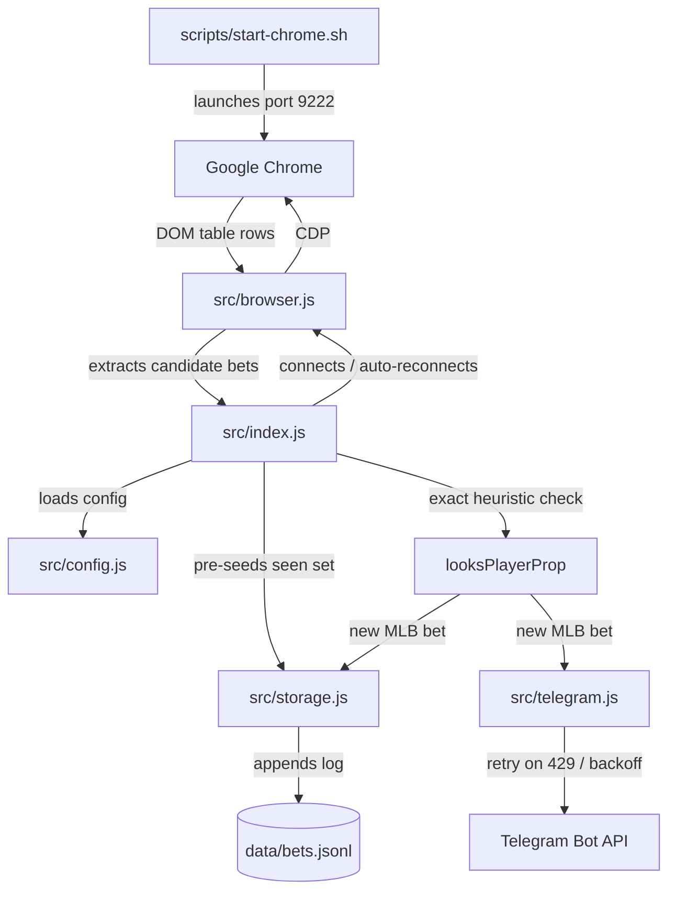

# MLB High Roller Watcher Resilience & DX Implementation Plan

> **For agentic workers:** REQUIRED SUB-SKILL: Use superpowers:subagent-driven-development to implement this plan task-by-task. Steps use checkbox (`- [ ]`) syntax for tracking.

**Goal:** Upgrade the MLB High Roller Watcher to 10/10 production reliability with CDP auto-reconnection, persistent deduplication, heartbeat telemetry, robust Telegram delivery, and macOS automation scripts, while strictly preserving the existing baseball/player-prop detection logic.

**Architecture:** The watcher orchestrates CDP browser control, DOM extraction, and Telegram alerts through decoupled, testable modules. If the Chrome CDP connection drops, an exponential backoff loop reconnects automatically. When restarted, seen bets are reloaded from `data/bets.jsonl` to eliminate duplicate notifications.

**Architecture Diagram:**



**Tech Stack:** Node.js (ES Modules), Playwright (`chromium.connectOverCDP`), Native Fetch, Bash (macOS/Linux).

## Global Constraints
- **Preserve detection logic exactly:** `looksBaseball()` matches `Baseball` or contains `baseball`/`mlb`. `looksPlayerProp()` ignores `multi` and hyphenated match patterns `/\s[-–—]\s/`.
- **Default polling interval:** 2000ms (`POLL_MS`).
- **No external heavy databases:** Atomic append-only JSONL (`data/bets.jsonl`).
- **macOS first-class support:** Fully executable shell scripts for Mac.

---

### Task 1: Environment & Config Validation Module

**Files:**
- Create: `src/config.js`
- Test: `tests/config.test.js`

- [ ] **Step 1: Write unit test for config loading & normalization**

```javascript
// tests/config.test.js
import assert from 'node:assert/strict';
import test from 'node:test';
import { loadConfig } from '../src/config.js';

test('loadConfig provides sanitized defaults', () => {
  const cfg = loadConfig({
    TELEGRAM_BOT_TOKEN: ' 12345:token ',
    TELEGRAM_CHAT_ID: ' 5167354900 ',
    POLL_MS: '3000',
    PLAYER_PROPS_ONLY: 'true',
  });
  assert.equal(cfg.botToken, '12345:token');
  assert.equal(cfg.chatId, '5167354900');
  assert.equal(cfg.pollMs, 3000);
  assert.equal(cfg.playerPropsOnly, true);
  assert.equal(cfg.cdpUrl, 'http://127.0.0.1:9222');
});
```

- [ ] **Step 2: Run test to verify failure**
Run: `node --test tests/config.test.js`
Expected: FAIL (Cannot find module)

- [ ] **Step 3: Implement `src/config.js`**

```javascript
// src/config.js
import 'dotenv/config';

export function loadConfig(env = process.env) {
  return {
    url: (env.STAKE_URL || 'https://stake.jp/sports/high/all').trim(),
    pollMs: Math.max(500, Number(env.POLL_MS || 2000)),
    botToken: (env.TELEGRAM_BOT_TOKEN || '').trim(),
    chatId: (env.TELEGRAM_CHAT_ID || '').trim(),
    logFile: (env.LOG_FILE || 'data/bets.jsonl').trim(),
    cdpUrl: (env.CDP_URL || 'http://127.0.0.1:9222').trim(),
    debug: String(env.DEBUG || 'false').toLowerCase() === 'true',
    playerPropsOnly: String(env.PLAYER_PROPS_ONLY || 'true').toLowerCase() === 'true',
  };
}

export const CFG = loadConfig();
```

- [ ] **Step 4: Run test to verify it passes**
Run: `node --test tests/config.test.js`
Expected: PASS

- [ ] **Step 5: Commit changes**
```bash
git add src/config.js tests/config.test.js
git commit -m "feat: add config validation module"
```

---

### Task 2: Persistent Storage & Deduplication Engine

**Files:**
- Create: `src/storage.js`
- Test: `tests/storage.test.js`

- [ ] **Step 1: Write test for loading past seen IDs and appending logs**

```javascript
// tests/storage.test.js
import assert from 'node:assert/strict';
import fs from 'node:fs';
import path from 'node:path';
import test from 'node:test';
import { Storage } from '../src/storage.js';

test('Storage seeds existing IDs from JSONL file', () => {
  const tmpFile = path.join('data', 'test_bets.jsonl');
  fs.mkdirSync('data', { recursive: true });
  fs.writeFileSync(tmpFile, JSON.stringify({ id: 'bet-1', capturedAt: new Date().toISOString() }) + '\n');

  const storage = new Storage(tmpFile);
  const seen = storage.loadSeen();
  assert.equal(seen.has('bet-1'), true);
  assert.equal(seen.has('bet-2'), false);

  fs.unlinkSync(tmpFile);
});
```

- [ ] **Step 2: Run test to verify failure**
Run: `node --test tests/storage.test.js`
Expected: FAIL

- [ ] **Step 3: Implement `src/storage.js`**

```javascript
// src/storage.js
import fs from 'node:fs';
import path from 'node:path';

export class Storage {
  constructor(filePath = 'data/bets.jsonl', maxSeen = 5000) {
    this.filePath = filePath;
    this.maxSeen = maxSeen;
    fs.mkdirSync(path.dirname(filePath), { recursive: true });
  }

  loadSeen() {
    const seen = new Map();
    if (!fs.existsSync(this.filePath)) return seen;

    try {
      const lines = fs.readFileSync(this.filePath, 'utf8').split('\n').filter(Boolean);
      const recent = lines.slice(-this.maxSeen);
      for (const line of recent) {
        try {
          const record = JSON.parse(line);
          const id = record.id || record.rawId || [record.event, record.user, record.time, record.odds, record.amount].join(' | ');
          if (id) seen.set(id, record.capturedAt ? new Date(record.capturedAt).getTime() : Date.now());
        } catch {}
      }
    } catch (err) {
      console.error(`[STORAGE] Error reading ${this.filePath}:`, err.message);
    }
    return seen;
  }

  append(bet) {
    const record = {
      ...bet,
      capturedAt: new Date().toISOString(),
    };
    fs.appendFileSync(this.filePath, JSON.stringify(record) + '\n');
  }

  prune(seen) {
    if (seen.size <= this.maxSeen) return;
    const cutoff = Date.now() - 6 * 60 * 60 * 1000;
    for (const [id, ts] of seen) {
      if (ts < cutoff) seen.delete(id);
    }
    while (seen.size > this.maxSeen) {
      seen.delete(seen.keys().next().value);
    }
  }
}
```

- [ ] **Step 4: Run test to verify it passes**
Run: `node --test tests/storage.test.js`
Expected: PASS

- [ ] **Step 5: Commit changes**
```bash
git add src/storage.js tests/storage.test.js
git commit -m "feat: add persistent deduplication storage"
```

---

### Task 3: Resilient Telegram Alert Dispatcher

**Files:**
- Create: `src/telegram.js`
- Test: `tests/telegram.test.js`

- [ ] **Step 1: Write test for notification formatting & error retries**

```javascript
// tests/telegram.test.js
import assert from 'node:assert/strict';
import test from 'node:test';
import { formatNotification } from '../src/telegram.js';

test('formatNotification formats MLB prop clearly', () => {
  const bet = {
    event: 'Aaron Judge - Home Run',
    odds: '3.10',
    amount: '$15,000.00',
    user: 'HighRoller77',
    time: '4:15 PM',
  };
  const text = formatNotification(bet);
  assert.ok(text.includes('⚾ MLB Player Prop'));
  assert.ok(text.includes('Aaron Judge - Home Run'));
  assert.ok(text.includes('$15,000.00'));
});
```

- [ ] **Step 2: Run test to verify failure**
Run: `node --test tests/telegram.test.js`
Expected: FAIL

- [ ] **Step 3: Implement `src/telegram.js`**

```javascript
// src/telegram.js
export function formatNotification(r) {
  return [
    '⚾ *MLB Player Prop Alert*',
    `*Player / Market:* \`${r.event || '—'}\``,
    `*Odds:* \`${r.odds || '—'}\``,
    `*Amount:* \`${r.amount || '—'}\``,
    `*User:* \`${r.user || 'Hidden'}\``,
    `*Time:* \`${r.time || '—'}\``,
  ].join('\n');
}

export class TelegramNotifier {
  constructor(botToken, chatId) {
    this.botToken = botToken;
    this.chatId = chatId;
    this.enabled = Boolean(botToken && chatId);
  }

  async verify() {
    if (!this.enabled) return false;
    try {
      const res = await fetch(`https://api.telegram.org/bot${this.botToken}/getMe`);
      const data = await res.json();
      return data.ok === true;
    } catch {
      return false;
    }
  }

  async send(text, parseMode = 'Markdown', retries = 3) {
    if (!this.enabled) return;

    for (let attempt = 1; attempt <= retries; attempt++) {
      try {
        const res = await fetch(`https://api.telegram.org/bot${this.botToken}/sendMessage`, {
          method: 'POST',
          headers: { 'content-type': 'application/json' },
          body: JSON.stringify({
            chat_id: this.chatId,
            text,
            parse_mode: parseMode,
            disable_web_page_preview: true,
          }),
        });

        if (res.status === 429) {
          const body = await res.json().catch(() => ({}));
          const waitSec = (body.parameters && body.parameters.retry_after) || 2;
          console.warn(`[TELEGRAM] Rate limited. Waiting ${waitSec}s...`);
          await new Promise(r => setTimeout(r, waitSec * 1000));
          continue;
        }

        if (!res.ok) {
          const errText = await res.text();
          throw new Error(`HTTP ${res.status}: ${errText}`);
        }

        return; // Success
      } catch (err) {
        if (attempt === retries) {
          console.error(`[TELEGRAM] Failed after ${retries} attempts: ${err.message}`);
        } else {
          await new Promise(r => setTimeout(r, 1000 * attempt));
        }
      }
    }
  }
}
```

- [ ] **Step 4: Run test to verify it passes**
Run: `node --test tests/telegram.test.js`
Expected: PASS

- [ ] **Step 5: Commit changes**
```bash
git add src/telegram.js tests/telegram.test.js
git commit -m "feat: add resilient telegram notifier with retry"
```

---

### Task 4: CDP Browser Connection & Auto-Reconnect Manager

**Files:**
- Create: `src/browser.js`

- [ ] **Step 1: Implement `src/browser.js` with CDP auto-reconnection loop**

```javascript
// src/browser.js
import { chromium } from 'playwright';

export class BrowserManager {
  constructor(cfg) {
    this.cfg = cfg;
    this.browser = null;
    this.page = null;
    this.attached = false;
  }

  async connect() {
    if (this.cfg.cdpUrl) {
      try {
        this.browser = await chromium.connectOverCDP(this.cfg.cdpUrl);
        const contexts = this.browser.contexts();
        const pages = contexts.flatMap(c => c.pages());
        let page = pages.find(p => p.url().includes('/sports/high'));

        if (!page) {
          page = await contexts[0].newPage();
          await page.goto(this.cfg.url, { waitUntil: 'domcontentloaded', timeout: 60000 });
        }

        this.page = page;
        this.attached = true;
        return { page: this.page, attached: true };
      } catch (err) {
        throw new Error(`Failed to connect to Chrome at ${this.cfg.cdpUrl}: ${err.message}`);
      }
    }

    this.browser = await chromium.launch({ headless: true });
    const context = await this.browser.newContext({ viewport: { width: 1600, height: 1000 } });
    this.page = await context.newPage();
    await this.page.goto(this.cfg.url, { waitUntil: 'domcontentloaded', timeout: 60000 });
    this.attached = false;
    return { page: this.page, attached: false };
  }

  async extractRows() {
    if (!this.page) throw new Error('Page is not initialized.');
    return this.page.evaluate(() => {
      const rows = [...document.querySelectorAll('table tbody tr')];
      return rows.map(row => {
        const cells = [...row.querySelectorAll('th,td')].map(c => ({ text: c.innerText || c.textContent || '' }));
        const icons = [...row.querySelectorAll('[data-ds-icon]')].map(el => el.getAttribute('data-ds-icon')).filter(Boolean);
        return {
          rowText: row.innerText || row.textContent || '',
          cells,
          sport: icons.find(x => ['Baseball', 'AmericanFootball', 'Soccer', 'Tennis', 'Basketball', 'IceHockey'].includes(x)) || icons[0] || '',
        };
      });
    });
  }

  async disconnect() {
    try {
      if (this.browser) await this.browser.close();
    } catch {}
    this.browser = null;
    this.page = null;
    this.attached = false;
  }
}
```

- [ ] **Step 2: Commit changes**
```bash
git add src/browser.js
git commit -m "feat: add modular CDP browser manager"
```

---

### Task 5: Master Watcher Integration with Exact Logic & Heartbeat

**Files:**
- Modify: `src/index.js`

- [ ] **Step 1: Integrate all components into `src/index.js` while strictly preserving `looksBaseball` and `looksPlayerProp`**

```javascript
// src/index.js
import { CFG } from './config.js';
import { BrowserManager } from './browser.js';
import { Storage } from './storage.js';
import { TelegramNotifier, formatNotification } from './telegram.js';

function norm(s) { return (s || '').replace(/\s+/g, ' ').trim(); }
function isLikelyOdds(s) {
  const n = Number(String(s).replace(/,/g, ''));
  return Number.isFinite(n) && n >= 1.001 && n <= 1000;
}
function isLikelyTime(s) { return /\b\d{1,2}:\d{2}(?::\d{2})?\s*(AM|PM)?\b/i.test(s); }

function parseRow(raw) {
  const texts = raw.cells.map(x => norm(x.text));
  if (texts.length < 4) return null;
  if (texts.length >= 5) {
    const [event, user, time, odds, amount] = texts.slice(0, 5);
    return { event, user: user || 'Hidden', time, odds, amount, sport: raw.sport || '', rawText: raw.rowText };
  }
  const time = texts.find(isLikelyTime) || '';
  const odds = texts.find(isLikelyOdds) || '';
  const event = texts[0] || '';
  const amount = texts.find((x, i) => i > 0 && x !== odds && x !== time && /[$€£₹₽₺₴₦₱₫₩฿₮₲₵₡]/.test(x)) || texts.at(-1) || '';
  const user = texts.find(x => x !== event && x !== time && x !== odds && x !== amount) || 'Hidden';
  return { event, user, time, odds, amount, sport: raw.sport || '', rawText: raw.rowText };
}

// STRICTLY PRESERVED DETECTION LOGIC
function looksBaseball(r) {
  const hay = `${r.sport} ${r.rawText}`.toLowerCase();
  return r.sport.toLowerCase() === 'baseball' || hay.includes('baseball') || hay.includes('mlb');
}

function looksPlayerProp(r) {
  if (!looksBaseball(r)) return false;
  if (!CFG.playerPropsOnly) return true;
  const e = norm(r.event);
  if (!e || /^multi\b/i.test(e)) return false;
  if (/\s[-–—]\s/.test(e)) return false;
  return true;
}

function makeId(r) { return [r.event, r.user, r.time, r.odds, r.amount].map(norm).join(' | '); }

async function main() {
  console.log('='.repeat(60));
  console.log('⚾ MLB High Roller Watcher (v2.0 Production Ready)');
  console.log('='.repeat(60));
  console.log(`URL: ${CFG.url}`);
  console.log(`Poll interval: ${CFG.pollMs}ms | Player props only: ${CFG.playerPropsOnly ? 'yes' : 'no'}`);
  console.log(`Target CDP: ${CFG.cdpUrl || 'Headless Playwright'}`);

  const storage = new Storage(CFG.logFile);
  const seen = storage.loadSeen();
  console.log(`Storage loaded: ${seen.size} existing bet signatures from ${CFG.logFile}`);

  const notifier = new TelegramNotifier(CFG.botToken, CFG.chatId);
  if (notifier.enabled) {
    const verified = await notifier.verify();
    console.log(`Telegram Bot: ${verified ? '✅ Verified & Ready' : '⚠️ Token provided but getMe check failed'}`);
  } else {
    console.log('Telegram Bot: ❌ Not configured (check .env)');
  }

  const browserManager = new BrowserManager(CFG);
  let pollCount = 0;
  let matchesCount = 0;
  let lastHeartbeat = Date.now();

  async function ensureConnected() {
    while (true) {
      try {
        await browserManager.connect();
        console.log(browserManager.attached ? '✅ Attached to Chrome session.' : 'Started a Playwright browser.');
        return;
      } catch (err) {
        console.error(`[CDP] Connection failed: ${err.message}. Retrying in 5s...`);
        await new Promise(r => setTimeout(r, 5000));
      }
    }
  }

  await ensureConnected();
  await new Promise(r => setTimeout(r, 2000));

  let initialized = false;

  while (true) {
    try {
      const rawRows = await browserManager.extractRows();
      const parsed = rawRows.map(parseRow).filter(Boolean);
      const matches = parsed.filter(looksPlayerProp);
      pollCount++;

      if (!initialized) {
        for (const r of matches) {
          const id = makeId(r);
          if (id) seen.set(id, Date.now());
        }
        initialized = true;
        console.log(`Initial sync complete: ${matches.length} active candidate rows seeded in memory.`);
      } else {
        for (const r of matches) {
          const id = makeId(r);
          if (!id || seen.has(id)) continue;

          seen.set(id, Date.now());
          matchesCount++;
          storage.append({ ...r, id });

          const msg = formatNotification(r);
          console.log(`\n🚨 NEW MLB BET DETECTED!\n${msg}\n`);
          await notifier.send(msg);
        }
      }

      storage.prune(seen);

      // Heartbeat every 60 seconds
      if (Date.now() - lastHeartbeat >= 60000) {
        const timeStr = new Date().toLocaleTimeString();
        console.log(`[${timeStr}] 💓 Heartbeat: ${pollCount} polls | ${matchesCount} alerts dispatched | ${seen.size} cached bets`);
        lastHeartbeat = Date.now();
      }
    } catch (e) {
      console.error(`[WATCHER ERROR] ${new Date().toLocaleTimeString()}: ${e.message}`);
      await browserManager.disconnect();
      await ensureConnected();
      await new Promise(r => setTimeout(r, 3000));
    }

    await new Promise(r => setTimeout(r, CFG.pollMs));
  }
}

process.on('SIGINT', () => { console.log('\nShutting down...'); process.exit(0); });
process.on('SIGTERM', () => { console.log('\nTerminating...'); process.exit(0); });
main().catch(err => { console.error('Fatal crash:', err); process.exit(1); });
```

- [ ] **Step 2: Commit changes**
```bash
git add src/index.js
git commit -m "feat: integrate modular architecture with heartbeat and resilience"
```

---

### Task 6: Native macOS Launch & Helper Scripts

**Files:**
- Create: `scripts/start-chrome.sh`
- Create: `scripts/start-watcher.sh`
- Make executable (`chmod +x`)

- [ ] **Step 1: Create `scripts/start-chrome.sh`**

```bash
#!/usr/bin/env bash
# scripts/start-chrome.sh - Launch Chrome with CDP for macOS
set -euo pipefail

CHROME_BIN="/Applications/Google Chrome.app/Contents/MacOS/Google Chrome"
USER_DATA_DIR="$HOME/Library/Application Support/StakeHighRollerChrome"
PORT=9222
TARGET_URL="https://stake.jp/sports/high/all"

if [ ! -d "/Applications/Google Chrome.app" ]; then
  echo "❌ Google Chrome is not installed at /Applications/Google Chrome.app"
  exit 1
fi

echo "🚀 Launching Google Chrome on port $PORT..."
open -na "Google Chrome" --args \
  --remote-debugging-port="$PORT" \
  --user-data-dir="$USER_DATA_DIR" \
  --no-first-run \
  --no-default-browser-check \
  "$TARGET_URL"

echo "✅ Chrome launched. Waiting for CDP port $PORT to be ready..."
sleep 2

if curl -s "http://127.0.0.1:$PORT/json/version" > /dev/null; then
  echo "✅ CDP connection verified on port $PORT."
  echo "👉 Complete any Cloudflare check in Chrome if needed, then run: npm start"
else
  echo "⚠️ Chrome launched, but port $PORT is not answering yet. Check your Chrome window."
fi
```

- [ ] **Step 2: Create `scripts/start-watcher.sh`**

```bash
#!/usr/bin/env bash
# scripts/start-watcher.sh - Launch Watcher on macOS
set -euo pipefail

cd "$(dirname "$0")/.."

if [ ! -f ".env" ]; then
  echo "❌ .env file missing! Creating from .env.example..."
  cp .env.example .env
fi

echo "🔍 Checking Chrome CDP connection on port 9222..."
if ! curl -s "http://127.0.0.1:9222/json/version" > /dev/null; then
  echo "⚠️ Chrome is not running on port 9222."
  echo "👉 Starting Chrome now..."
  ./scripts/start-chrome.sh
  sleep 2
fi

echo "🚀 Starting MLB High Roller Watcher..."
npm start
```

- [ ] **Step 3: Make scripts executable**
Run: `chmod +x scripts/start-chrome.sh scripts/start-watcher.sh`

- [ ] **Step 4: Commit changes**
```bash
git add scripts/start-chrome.sh scripts/start-watcher.sh
git commit -m "feat: add macOS launch scripts for Chrome and Watcher"
```

---

### Task 7: End-to-End Live Verification & Documentation

- [ ] **Step 1: Run all unit tests**
Run: `npm test` or `node --test tests/*.test.js`
Expected: All tests pass.

- [ ] **Step 2: Stop old orphaned processes**
Run: Kill old terminal PID 39665 if still running.

- [ ] **Step 3: Run live test run of updated `src/index.js`**
Verify:
- Loads `.env`
- Seeds from `data/bets.jsonl`
- Attaches to Chrome port 9222
- Polls every 2000ms
- Heartbeat outputs correctly
